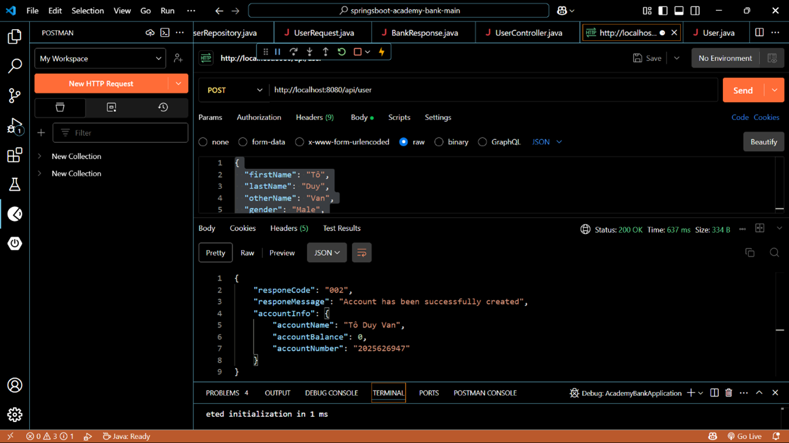
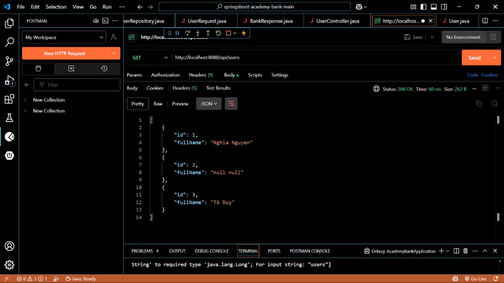
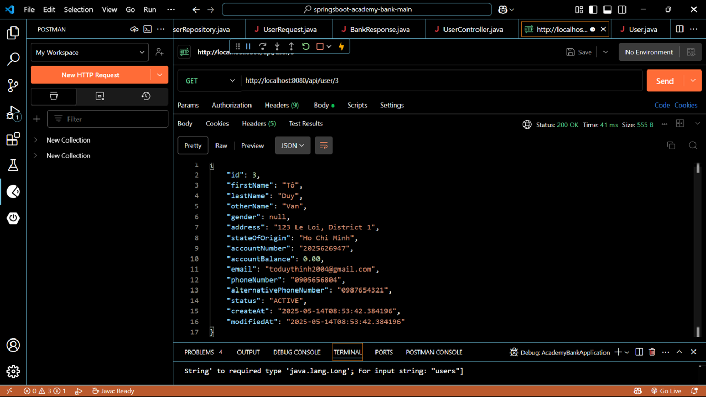
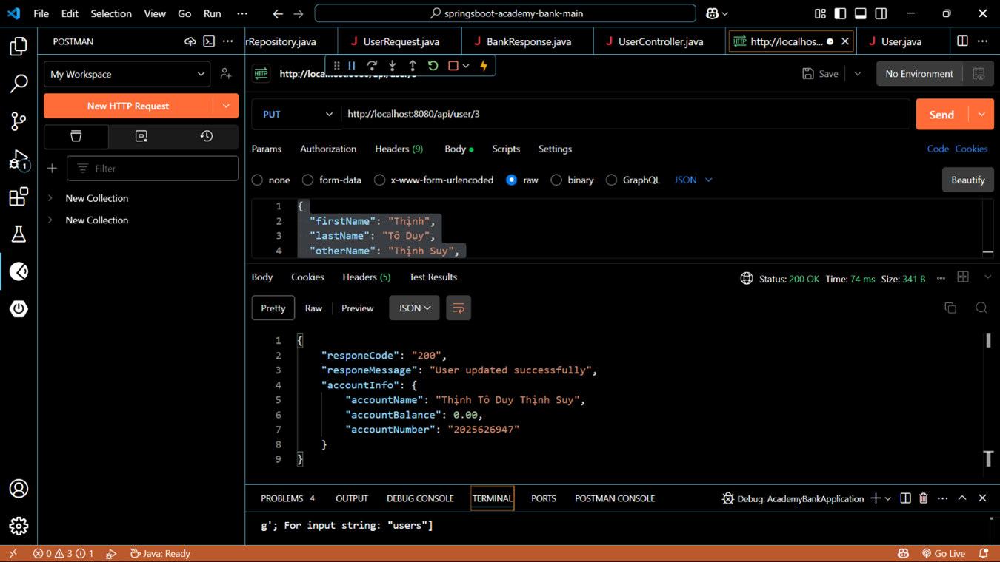
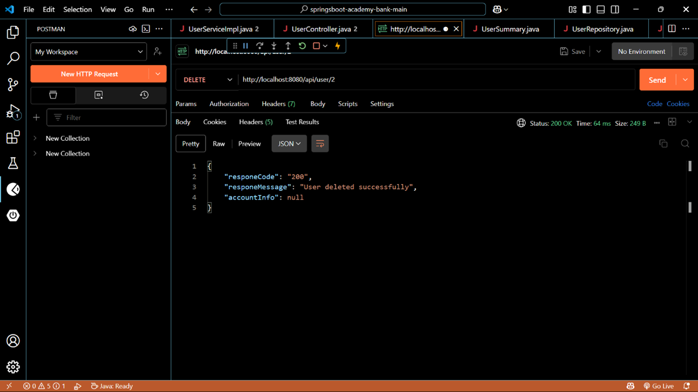

# Academy Bank Backend

Backend service for managing user accounts and banking operations in the Academy Bank system.

---

## 🛠️ API Endpoints - User Management

The backend exposes the following RESTful API endpoints for managing users:

| HTTP Method | Endpoint         | Description                    | Request Body         | Response        |
|-------------|------------------|-------------------------------|----------------------|-----------------|
| POST        | /api/user        | Create a new user account      | UserRequest JSON     | BankResponse    |
| GET         | /api/users       | Get all users (only id and name) | None                 | List of UserSummary |
| GET         | /api/user/{id}   | Get details of a specific user | None                 | User object     |
| PUT         | /api/user/{id}   | Update a specific user         | UserRequest JSON     | BankResponse    |
| DELETE      | /api/user/{id}   | Delete a specific user         | None                 | BankResponse    |

### Endpoint Details

#### 1. Create a New User Account
- **URL:** `/api/user`
- **Method:** `POST`
- **Description:** Creates a new user account using the data in the request body.

2. Get All Users (Summary)
URL: /api/users

Method: GET

Description: Returns a list of all users with only ID and username.

3. Get User Details by ID
URL: /api/user/{id}

Method: GET

Description: Retrieves detailed user information by ID.

4. Update User Details by ID
URL: /api/user/{id}

Method: PUT

Description: Updates the user identified by ID with data from the request body.

5. Delete User by ID
URL: /api/user/{id}

Method: DELETE

Description: Deletes the user account with the specified ID.

